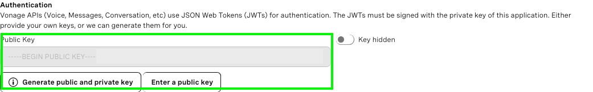
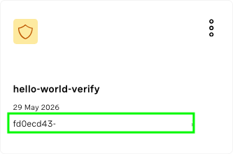
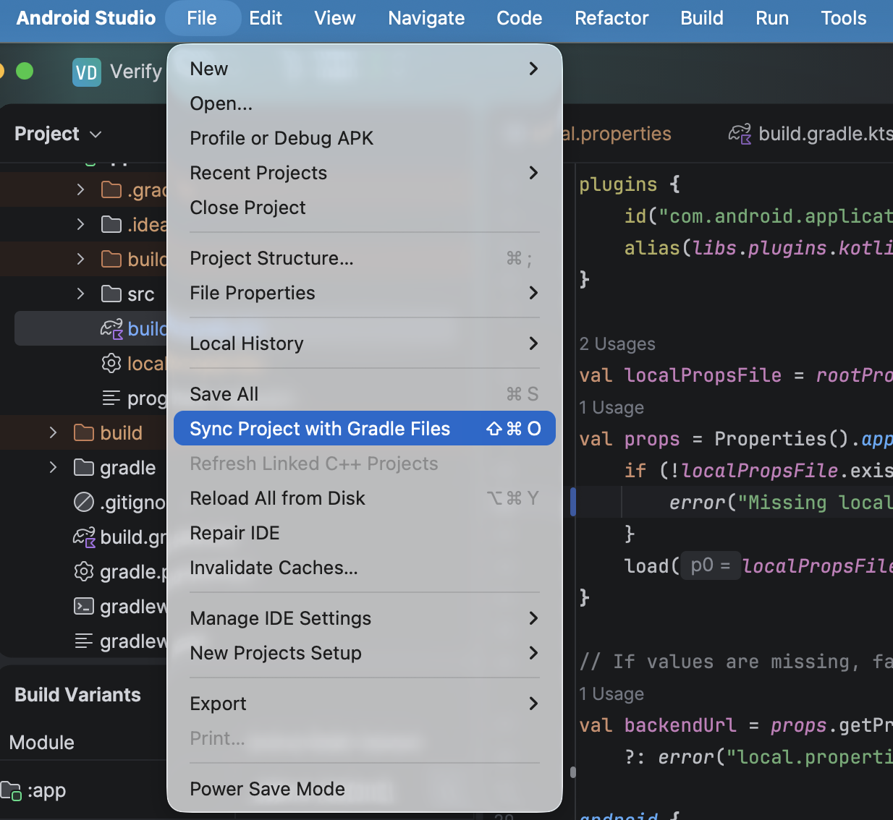
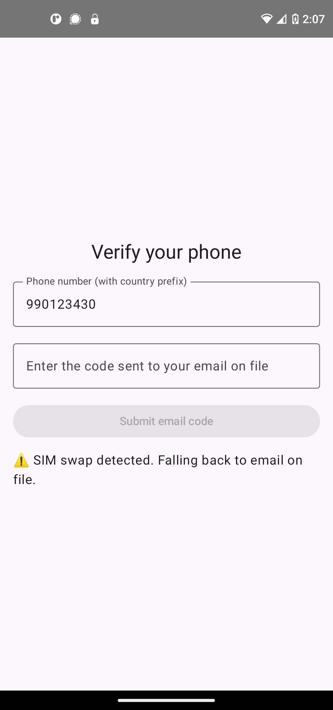
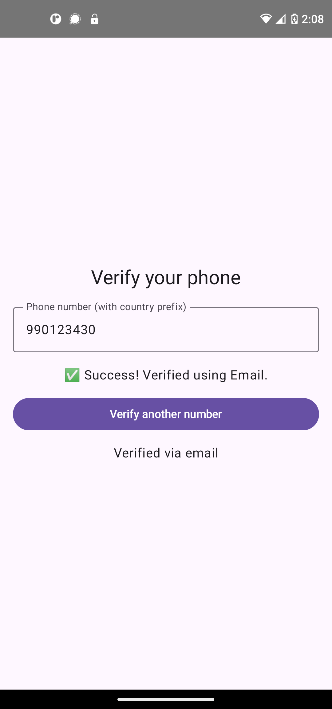
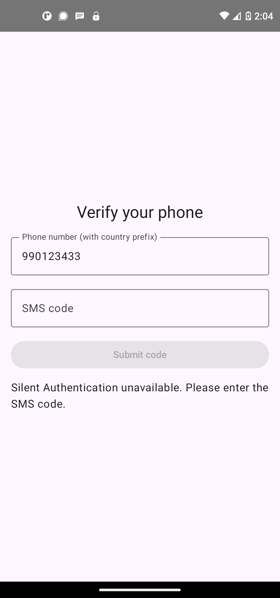
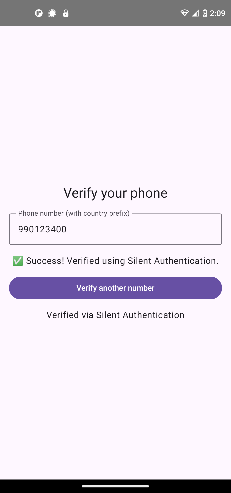

# Silent Auth + SIM Swap Demo

A full-stack demo application showcasing a layered mobile authentication flow using the Vonage Verify API. The backend is built with FastAPI (Python) and the client is an Android app built with Jetpack Compose.

## About This Repo

This repository demonstrates a progressive authentication flow that combines three [Vonage Network APIs](https://vonage.dev/4q6FbU6):

1. **SIM Swap** — checks whether a phone number's SIM has been swapped recently, flagging it as potentially compromised
2. **Silent Authentication** — performs a carrier-level identity check invisibly in the background, with no user input required
3. **Email OTP / SMS OTP** — fallback verification channels used when silent auth is unavailable or a SIM swap is detected

### Features

- SIM Swap detection with automatic step-up to email OTP
- Silent Authentication via the Vonage Verify API and the Vonage Android Client SDK
- Automatic fallback to SMS OTP when silent auth fails
- FastAPI backend with clean separation of verification logic
- Android client built with Jetpack Compose

### Built with

- [FastAPI](https://fastapi.tiangolo.com/)
- [Vonage Verify API](https://vonage.dev/4nYXkCu)
- [Vonage Android Client SDK](https://vonage.dev/4wgu8cJ)
- [Jetpack Compose](https://developer.android.com/compose)

### File structure
```
.
├── client/                          # Android app (Jetpack Compose)
│   └── app/src/main/kotlin/com/vonage/verify2/app/
│       ├── ApiClient.kt             # Vonage API calls + SilentAuthUnavailableException
│       ├── MainActivity.kt          # Entry point, SDK initialization
│       ├── VerificationScreen.kt    # UI + verification flow logic
│       └── VerifyUiState.kt         # UI state, data models, VerifyApiClient interface
│
└── server/                          # FastAPI backend (Python)
    ├── main.py                      # API endpoints
    ├── vonage_handlers.py           # Vonage SDK calls (SIM swap, silent auth, SMS, email)
    ├── requirements.txt
    └── .env                         # VONAGE_APPLICATION_ID, VONAGE_PRIVATE_KEY_PATH, etc.
```
### API endpoints

| Method | Endpoint | Description |
|---|---|---|
| `POST` | `/verification` | Starts the auth flow: checks SIM swap, then initiates silent auth or steps up to email |
| `POST` | `/fallback-sms` | Sends an SMS OTP to the configured real number (demo/testing use) |
| `POST` | `/send-email-otp` | Sends an email OTP to the address on file for the given phone number |
| `POST` | `/check-code` | Verifies a submitted OTP code against a `request_id` |

---

### Authentication flow

```
Client                  Backend                 Vonage
  |                        |                       |
  |-- POST /verification ->|                       |
  |                        |-- SIM Swap check ---->|
  |                        |<-- swapped: false ----|
  |                        |-- Silent Auth ------->|
  |                        |<-- request_id + ------|
  |                             check_url          |
  |<-- check_url ----------|                       |
  |                                                |
  |-- GET check_url (cellular) ------------------>|
  |<-- code --------------------------------------|
  |                        |                       |
  |-- POST /check-code --->|                       |
  |                        |-- verify code ------->|
  |<-- verified: true -----|                       |
```

If a SIM swap is detected, the flow steps up to email OTP. If silent auth fails on the client (no cellular, unsupported carrier), the client calls `/fallback-sms` and the user is prompted to enter an SMS code instead.

## Getting Started

### Prerequisites

- Python 3.8+
- Android Studio
- A Vonage API account
- An [ngrok account and installation](https://vonage.dev/4d9waov)
- An Android device ([Silent Authentication](https://vonage.dev/4xvRbkH) requires a real device on cellular data -— it will not work on an emulator)

## Creating a Vonage Application

### What is Vonage?

Vonage is a cloud-based communications platform that gives you the tools to embed communication capabilities directly into your own applications and services. Rather than building communication infrastructure from scratch, you can use Vonage APIs to add voice, video, messaging, verification, and other network-level capabilities to your products.

To run this demo, you need a Vonage developer account and a Verify application.

### 1. Create a Vonage account

[Sign up for a free Vonage API account](https://vonage.dev/4z9aQsn).

### 2. Create a Verify application

Create your Verify application in the [developer dashboard](https://dashboard.nexmo.com/) by navigating to **Applications** in the left-hand menu and clicking **Create new application**.

1. Give your application a name (e.g. `silent-auth-demo`)
2. Under **Capabilities**, toggle **Verify**
3. Click **Generate new application**


### 3. Obtain your Vonage secrets

In the dashboard, open your application and click **Edit**, then click **Generate public and private key**. This will download a `private.key` file —- **keep this file private and do not share it anywhere it could be compromised**.

Also note your Application ID.





You will need these secrets to configure your environment variables.

### 4. Configure the Network Registry Playground

The Playground allows you to start using the Network Features without approval of a business profile by the operators. In order to use your real number with this demo app, you will need to [configure the Playground for your Vonage application](https://vonage.dev/4fQ4V3Q).

You can also use Vonage Virtual Operator to [test certain workflows](#testing-different-scenarios-with-vonage-virtual-operator).

## Running the Server

### 1. Clone this repo

```bash
git clone <repo-url> && cd <repo-directory>/server
```

### 2. Set up your environment

Create and activate a Python virtual environment, then install dependencies:

```bash
python -m venv venv && source venv/bin/activate
pip install -r server/requirements.txt
```

### 3. Configure your environment variables

Change directories into `server/`.

Copy `.env_template` to `.env` and fill in your values:

```bash
VONAGE_APPLICATION_ID=your-application-id 
VONAGE_PRIVATE_KEY_PATH=path/to/private.key
USER_EMAIL=you@example.com
USER_PHONE_NUMBER=12015550123
```

These are explained more in-depth below:

| Variable | Value |
|---|---|
| `VONAGE_APPLICATION_ID` | The ID of the Vonage application you created |
| `VONAGE_PRIVATE_KEY_PATH` | Path to the `private.key` file downloaded from the dashboard |
| `USER_PHONE_NUMBER` | Your real phone number (E.164 format, e.g. `12015550123`) -— used as the SMS OTP destination for testing |
| `USER_EMAIL` | Your email address —- used as the email OTP destination for testing |

Learn more about environment variables [here](https://vonage.dev/4wteA6n).

### 4. Run the server

From the `server/` directory, run the following:

```bash
uvicorn main:app --reload --port 4000
```

The server will start at `http://0.0.0.0:4000`.

### 5. Spin up an ngrok tunnel

In a separate terminal window, run:

```bash
ngrok http 4000
```

This command will generate the public URLs your local server will tunnel to on port 4000. Take note of the public URL -– it should look something like this and you'll need it later:

```bash
Forwarding                	https://some-public-url.ngrok-free.app -> http://localhost:4000
```

Read more about using ngrok [here](https://vonage.dev/4d9waov).

## Running the Android Client

### 1. Open the project

Open the `client/` directory in Android Studio.

### 2. Configure build variables

Create a file named `local.properties` and set:

```bash
BACKEND_URL=<your-ngrok-tunnel>
```

### 3. Download dependencies

Sync Gradle to download the dependencies.



### 4. Connect a device and run the app

Connect a physical Android device over USB and build and run the app. Silent Authentication requires a real device on a cellular data connection -— it will not work on an emulator or over Wi-Fi.

## Trying Out the Silent Auth + SIM Swap Demo

### Scenario 1: SIM swap flagged, fallback to email

> Note: In this demo we use in-memory storage and a test email address to simulate a database -- this is not an appropriate solution in a production grade application.

In this scenario, the SIM is flagged as recently swapped, meaning that Silent Authentication probably isn't a trustworthy form of verification either, so the app falls back to verification via email.



The user receives a one-time passcode (OTP) via email and upon providing that code to the app, Vonage checks it against the Vonage-generated code, and if they match, the user is authenticated.



### Scenario 2: Silent Authentication fails or is unavailable, fallback to SMS

In this scenario, the SIM swap check passes, triggering the Silent Authentication flow, which does not complete (either due to failure or unavailability). The app falls back to verification via SMS.



The user receives a one-time passcode (OTP) via SMS and upon providing that code to the app, Vonage checks it against the Vonage-generated code, and if they match, the user is authenticated.


### Scenario 3: SIM swap passes and Silent Authentication completes successfully

In this scenario, the SIM swap check passes, triggering the Silent Authentication flow, which is successfully completed. The user is seamlessly authenticated without any additional input.



### Testing different scenarios with Vonage Virtual Operator

The Network Registry Playground requires at least one working phone number added to the allowlist from a supporting operator and, in some cases, mobile data access to a supported operator. There may be scenarios where allowlisting a valid phone number is not possible, such as when testing the Network Features in a country that is not yet supported.

To solve this situation, the Playground offers a [Virtual Operator](https://vonage.dev/4g38DpA) that provides predefined and deterministic API responses based on the parameters of the API request. You can use these numbers to test this demo app with different scenarios:

| Number | Response | Scenario |
|---|---|---|
| 990123430 | `"is_swapped": True` | Fallback to email |
| 990123433 | `"is_swapped": false`, `user_rejected` | Fallback to SMS |
| 990123400 | `"is_swapped": false`, `completed` | SIM swap passes and Silent Authentication completed |

## References
- **[Vonage Verify API Documentation](https://vonage.dev/4nYXkCu):** The Verify API is our next generation two-factor authentication (2FA) product. Authenticate your users and prevent fraud with our simple, easy-to-use API that removes the complexity of 2FA at a global scale.
- **[Vonage Network APIs — Silent Authentication](https://vonage.dev/4xvRbkH):** Silent Authentication uses a mobile phone's Subscriber Identity Module (SIM) to verify a user's identity, without any user input. It checks the user's phone number against their carrier's records to confirm that it is active and legitimate.
- **[Vonage Network APIs — SIM Swap](https://vonage.dev/45hVFiT):** The SIM Swap Insight allows you to determine if the SIM card linked to a given phone number has recently changed.
- **[Vonage Android Client SDK](https://vonage.dev/4g4okNn):** Build in-app messaging, voice, and video solutions for use with Android.